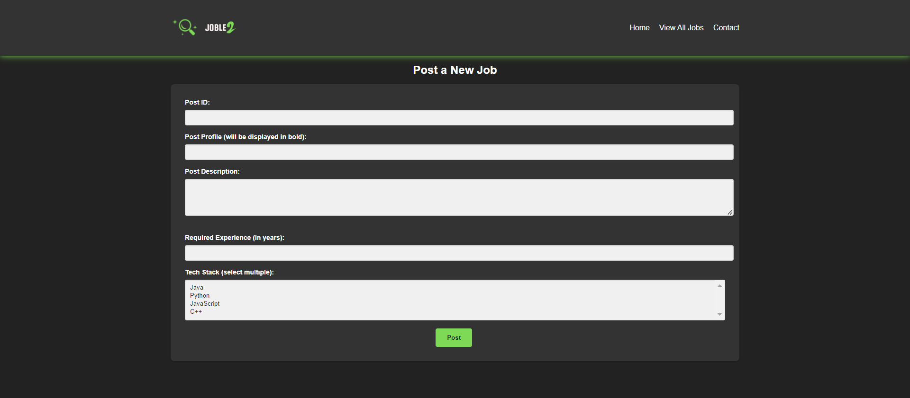

# JobLe2 - My Job Portal Learning Project (React + Spring Data JPA)

<div align="center">
  <a href="https://github.com/AnirudhHanda/JobLe2---JPA">
    
  </a>
</div>

This is an enhanced version of my JobLe2 project, now utilizing Spring Data JPA for efficient database interaction. The frontend remains built with React.js, while the backend leverages the power of Spring Boot and JPA for seamless data persistence.

## Features

* User-friendly interface (improved with React components!)
* Basic job posting and viewing functionality
* Dark theme for a cool look
* **Persistent data storage using Spring Data JPA**

## About Spring Data JPA

Spring Data JPA is a powerful module in the Spring framework that simplifies database access and management in Java applications. It builds upon the Java Persistence API (JPA), a standard specification for object-relational mapping (ORM) in Java.

**Key benefits of using Spring Data JPA:**

* **Reduced boilerplate code:** JPA and Spring Data JPA abstract away much of the low-level database interaction code, allowing you to focus on your application's logic.
* **Database independence:** You can switch between different database providers (e.g., MySQL, PostgreSQL, H2) with minimal code changes, thanks to JPA's portability.
* **Simplified querying:** Spring Data JPA provides a rich set of query methods and the ability to define custom queries using JPQL (Java Persistence Query Language) or native SQL, reducing the need to write complex SQL queries directly.

## Security

I have learned Spring Security and implemented it in this project esthetically and beautifully. The application now includes basic user authentication and authorization.

### Steps Taken:

1. **Added Spring Security Dependency:**
   - Included the Spring Security dependency in the `pom.xml` file.

2. **Configured Security:**
   - Created a `SecurityConfig` class to configure HTTP security and user authentication.

3. **Implemented User Details Service:**
   - Created a `UserPrincipal` class implementing `UserDetails` to represent authenticated users.
   - Configured a custom `UserDetailsService` to load user-specific data.

4. **Updated Application Properties:**
   - Configured security-related properties in `application.properties`.

5. **Secured Endpoints:**
   - Restricted access to API endpoints, allowing only authenticated users to access them.

## Screenshots

* Home Page

<div align="center">
  
</div>

* Job Posting Form

<div align="center">
  
</div>

* Job Listings Page

<div align="center">
  
</div>

* Success Page

<div align="center">
  
</div>

## Technologies Used

* **Frontend:**
    * React.js
    * HTML
    * CSS
* **Backend:**
    * Java
    * Spring Boot
    * Spring Data JPA
    * [Your Database Choice] (e.g., MySQL, PostgreSQL, H2)

## Getting Started

### Prerequisites

* Node.js and npm
* Java JDK 17 or above
* [Your Database Choice] (Make sure it's installed and running)

### Running the Application

#### 1. Frontend (React)

1. **Navigate to the frontend directory** (it's named `frontend`):
   ```bash
   cd frontend

2. **Install dependencies:**
   ```bash
   npm install

3. **Start the development server:**

   ```bash
   npm start

#### 2. Backend (Spring Boot)
If you're using IntelliJ IDEA or Eclipse:

1.  **Open the project in your IDE:**
*   IntelliJ IDEA: `File -> Open` and select the cloned project folder.
*   Eclipse: `File -> Import -> Existing Maven Projects` and select the cloned project folder.

2.  **Run the application:**
*   Locate the `O223JobLe2WithJpaApplication.java` file.
*   Right-click on it and choose "Run 'App.java'" or a similar option.

3.  **Access the application:**
*   Once the application starts, open your web browser and go to `http://localhost:8080`.

#### 2. Using Maven (For VS Code or Command Line)

If you prefer using VS Code or the command line, you'll need Maven installed:

1. **Install Maven:**
* Download and install Maven from the [official Apache Maven website](https://maven.apache.org/download.cgi).
* Make sure the `mvn` command is available in your terminal or command prompt.

2. **Navigate to the project directory:**
*  ``` Bash
       cd O15SpringDataJPA2/O223JobLe2WithJpaApplication

3. **Build and run the application:**
*  ```bash
      ./mvnw spring-boot:run 

4. **Access the application:**
*   Once the application starts, open your web browser and go to `http://localhost:8080`.

### Running the Application
Feel free to contribute if you have any ideas or improvements!
## License

This project is licensed under the MIT License.

<div align="center">
  
   
</div>

Thank you for checking out my JobLe2 project! I hope this learning journey with Java, Spring Boot, React, and Spring Data JPA has been as insightful for you as it has been for me.

If you have any questions, suggestions, or just want to connect, feel free to reach out. Let's keep brewing awesome code together! ☕